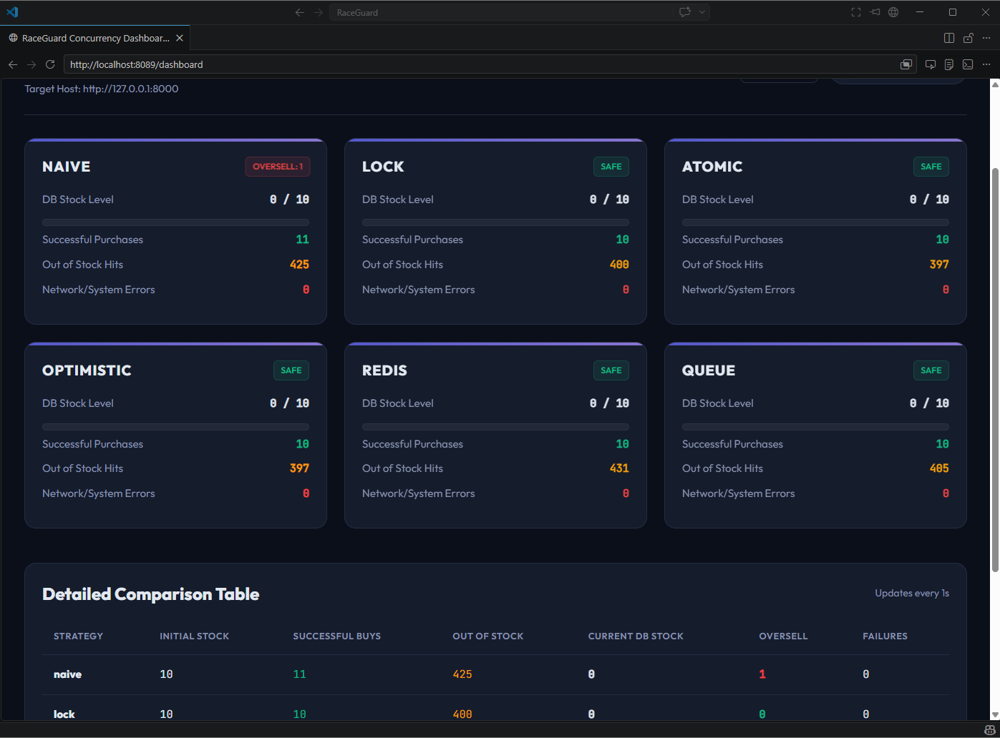
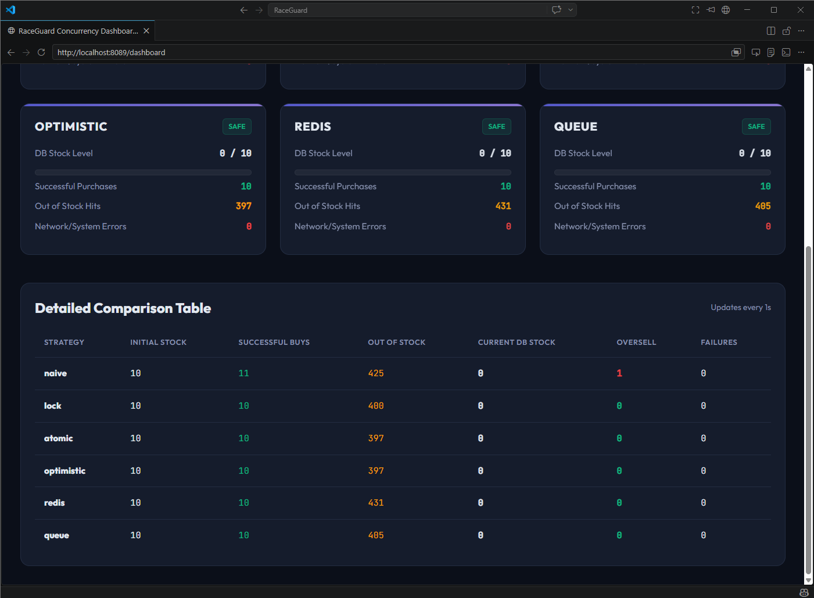
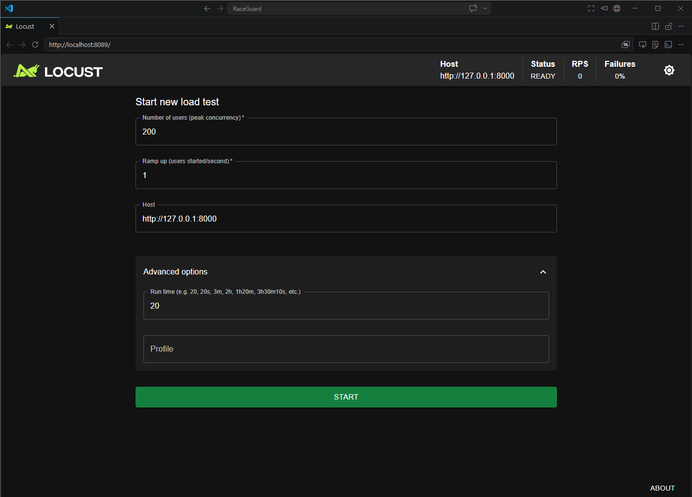

# RaceGuard 🏁

> An overselling prevention system that **demonstrates and solves race conditions** under high concurrency using six distinct concurrency strategies — with a **real-time live dashboard** to watch them race.

---

## Screenshots

### Live Dashboard


### Oversell Detection


### Locust Load Test UI


> _Run `make load-test` and open **http://localhost:8089/dashboard** to see it live._

---

## Architecture

```
┌────────────────────────────────────────────────────────────┐
│                      HTTP Clients                          │
│          (curl / Locust / ThreadPoolExecutor tests)        │
└──────────────────────────┬─────────────────────────────────┘
                           │ POST /buy?mode=<strategy>
                           ▼
┌───────────────────────────────────────────────────────────┐
│                    FastAPI  (Uvicorn)                     │
│                       app/main.py                         │
│                                                           │
│   ┌───────────────────────────────────────────────────┐   │
│   │              Strategy Router                      │   │
│   │  mode param → dispatches to correct strategy fn   │   │
│   └──────┬──────┬──────┬──────┬──────┬────────────────┘   │
│          │      │      │      │      │                    │
│        naive  lock  atomic optim queue  redis             │
│          │      │      │      │      │      │             │
│       global threading threading dict  Queue  Redis       │
│        int    Lock    CAS    +ver  Worker  DECR           │
└───────────────────────────────────────────────────────────┘
                                                │
                                    ┌───────────▼───────────┐
                                    │   Redis 7 (Docker)    │
                                    │   stock key (DECR)    │
                                    └───────────────────────┘

┌────────────────────────────────────────────────────────────┐
│               Locust Web UI  (Flask, port 8089)            │
│   /dashboard        ← Premium real-time GUI dashboard      │
│   /live_stats       ← JSON feed polled every 1 s           │
│   /reset_live_stocks← One-click reset from dashboard       │
└────────────────────────────────────────────────────────────┘
```

---

## Overview

Flash sales create a classic concurrency problem: thousands of users race to buy the last few items simultaneously. Without proper synchronisation, a naive system will oversell — selling the same unit multiple times.

RaceGuard benchmarks **six concurrency strategies** side-by-side through the same `POST /buy?mode=<strategy>` endpoint.

| Strategy | Thread-Safe | Oversell Risk | Throughput |
|----------|:-----------:|:-------------:|:----------:|
| `naive` | ❌ | 🔴 High | 🟢 Highest |
| `lock` | ✅ | 🟢 None | 🟡 Medium |
| `atomic` | ✅ | 🟢 None | 🟡 Medium |
| `optimistic` | ✅ | 🟢 None* | 🟡 Medium |
| `redis` | ✅ | 🟢 None | 🟢 High |
| `queue` | ✅ | 🟢 None | 🔴 Lowest |

→ Full details in [docs/strategies.md](./docs/strategies.md)

---

## Quick Start

```bash
# 1. Clone & install
git clone <repo-url> && cd raceguard
python -m venv venv && venv\Scripts\activate   # Windows
pip install -r requirements.txt

# 2. Start Redis
docker compose up -d redis

# 3. Start API server (Terminal 1)
make run

# 4. Start load test + live dashboard (Terminal 2)
make load-test
# → Open http://localhost:8089/dashboard
```

→ Full setup guide in [docs/setup.md](./docs/setup.md)

---

## Key Commands

```bash
make run                  # Dev server  → http://127.0.0.1:8000
make run-prod             # Production multi-worker server
make test                 # Run full test suite
make load-test            # Locust UI + live dashboard (port 8089)
make load-test-headless   # Headless: 50 users, 10/s, 30s
make docker-up            # Start Redis container
make docker-down          # Stop all containers
make reset                # Reset all stocks via API
make stock                # Print current stock levels
```

---

## API Endpoints

| Method | Path | Description |
|--------|------|-------------|
| `POST` | `/buy?mode=<strategy>` | Buy using a strategy (`naive`, `lock`, `atomic`, `optimistic`, `redis`, `queue`) |
| `GET`  | `/stock` | Current stock for all strategies |
| `POST` | `/reset` | Reset all strategies to `INITIAL_STOCK` |

```bash
# Examples
curl -X POST "http://localhost:8000/buy?mode=redis"
curl -X POST "http://localhost:8000/buy?mode=naive"
curl      "http://localhost:8000/stock"
curl -X POST "http://localhost:8000/reset"
```

---

## Project Structure

```
raceguard/
├── app/
│   ├── main.py              ← FastAPI app, /buy /stock /reset
│   ├── config.py            ← INITIAL_STOCK, REDIS_URL
│   └── strategies/
│       ├── naive.py         ← No sync (race condition demo)
│       ├── lock.py          ← threading.Lock
│       ├── atomic.py        ← Compare-and-Swap loop
│       ├── optimistic.py    ← Versioned optimistic locking
│       ├── redis_atomic.py  ← Redis DECR (distributed-safe)
│       └── queue_strategy.py← Single-worker queue
├── tests/
│   └── test_concurrent.py  ← ThreadPoolExecutor concurrent tests
├── docs/
│   ├── strategies.md        ← Strategy deep-dive & sample results
│   ├── dashboard.md         ← Live dashboard guide
│   └── setup.md             ← Full setup, API ref, Makefile targets
├── locustfile.py            ← Locust load test + live dashboard GUI
├── docker-compose.yml       ← Redis service
├── Makefile                 ← Convenience targets
├── requirements.txt
└── .env.example
```

---

## Docs

| Document | Contents |
|----------|----------|
| [docs/strategies.md](./docs/strategies.md) | Strategy deep-dive, comparison table, sample results |
| [docs/dashboard.md](./docs/dashboard.md) | Dashboard features, how it works, lifecycle events |
| [docs/setup.md](./docs/setup.md) | Full setup, tests, load testing, API ref, Makefile |

---

## License

MIT — free to use, modify, and distribute.
